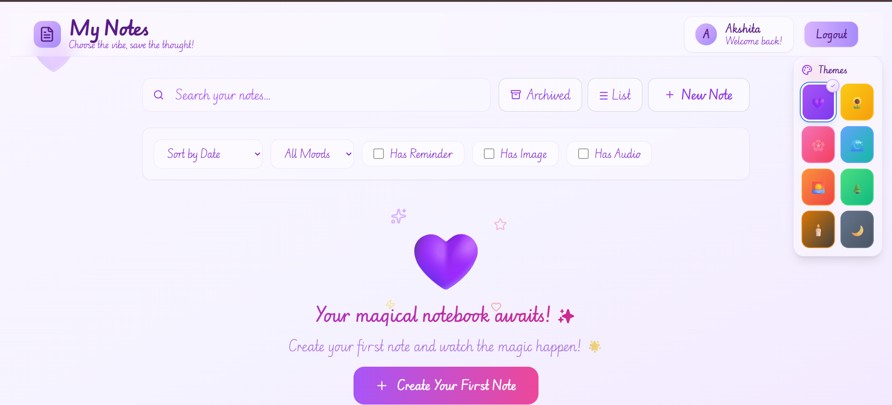

# My Notes

A beautiful, feature-rich notes application built with React and FastAPI that transforms your note-taking experience into something truly magical.



## Features

### Rich Note Management
- **Create, Edit & Delete** notes with an intuitive interface
- **Real-time search** functionality to quickly find your notes
- **Drag & drop** reordering for perfect organization
- **Pin important notes** to keep them at the top
- **Archive system** to declutter while preserving content

### Beautiful Theming
- **8 stunning themes** to match your mood and style
- **Dynamic color schemes** including Purple Magic, Sunset Orange, Pink Bliss, and more
- **Smooth transitions** and elegant animations throughout the interface

### Media Support
- **Image uploads** with automatic thumbnail generation
- **Audio recording** and playback capabilities
- **File management** with organized storage system

### Smart Organization
- **Custom labels** for categorizing notes
- **Advanced filtering** by content type, mood, and attributes
- **Sort options** by date, title, or custom preferences
- **Reminder system** for important tasks and deadlines

### User Authentication
- **Secure registration** and login system
- **Password reset** functionality
- **Session management** with JWT tokens
- **User profiles** with personalized settings

### Modern Architecture
- **Progressive Web App (PWA)** capabilities
- **Responsive design** that works on all devices
- **Offline support** with service worker integration
- **Real-time updates** and seamless synchronization

## Tech Stack

### Frontend
- **React 18** with modern hooks and context
- **Vite** for lightning-fast development and building
- **Tailwind CSS** for beautiful, utility-first styling
- **React Beautiful DnD** for smooth drag-and-drop interactions
- **Date-fns** for elegant date handling

### Backend
- **FastAPI** for high-performance API development
- **SQLAlchemy** with SQLite database
- **JWT Authentication** for secure user sessions
- **Pydantic** for robust data validation
- **Uvicorn** ASGI server for production-ready performance

### Additional Technologies
- **Python-Jose** for JWT token handling
- **Passlib** with bcrypt for secure password hashing
- **Pillow** for image processing and thumbnails
- **BeautifulSoup4** for link preview generation
- **HTTPX** for external API calls

## Installation

### Prerequisites
- **Node.js** (v16 or higher)
- **Python** (v3.8 or higher)
- **npm** or **yarn**

### Backend Setup
```bash
# Navigate to the backend directory
cd backend

# Install Python dependencies
pip install -r requirements.txt

# Start the FastAPI server
python main.py
```

The backend server will be available at `http://localhost:8000`

### Frontend Setup
```bash
# Install Node.js dependencies
npm install

# Start the development server
npm run dev
```

The frontend will be available at `http://localhost:5173`

## 🔧 Configuration

### Environment Variables
Create a `.env` file in the root directory:
```env
VITE_API_URL=http://localhost:8000
```

### Backend Configuration
The backend uses `python-decouple` for configuration. You can create a `.env` file in the `backend` directory:
```env
SECRET_KEY=your-secret-key-here
DATABASE_URL=sqlite:///./notes_app.db
```

## Usage

1. **Register** a new account or **login** with existing credentials
2. **Create your first note** using the prominent call-to-action button
3. **Customize your experience** with themes and preferences
4. **Upload images and audio** to enrich your notes
5. **Organize with labels** and use filters to find content quickly
6. **Set reminders** for important tasks and deadlines

## Project Structure

```
notes_app/
├── backend/
│   ├── main.py              # FastAPI application entry point
│   ├── models.py            # Database models
│   ├── schemas.py           # Pydantic schemas
│   ├── auth.py              # Authentication logic
│   ├── database.py          # Database configuration
│   └── requirements.txt     # Python dependencies
├── src/
│   ├── components/          # React components
│   ├── hooks/              # Custom React hooks
│   ├── api.js              # API client
│   ├── App.jsx             # Main application component
│   └── main.jsx            # Application entry point
├── public/                 # Static assets
│   └── image.png           # App screenshot
└── package.json           # Node.js dependencies
```

## Deployment

### Production Build
```bash
# Build the frontend for production
npm run build

# Start the backend in production mode
cd backend
uvicorn main:app --host 0.0.0.0 --port 8000
```

### Docker Support (Optional)
```dockerfile
# Example Dockerfile structure
FROM node:18-alpine AS frontend
# ... frontend build steps

FROM python:3.11-slim AS backend
# ... backend setup steps
```

## Contributing

1. **Fork** the repository
2. **Create** a feature branch (`git checkout -b feature/amazing-feature`)
3. **Commit** your changes (`git commit -m 'Add some amazing feature'`)
4. **Push** to the branch (`git push origin feature/amazing-feature`)
5. **Open** a Pull Request

## License

This project is licensed under the MIT License. See the [LICENSE](LICENSE) file for details.

## Acknowledgments

- Beautiful design inspiration from modern note-taking applications
- Amazing open-source community for the fantastic libraries used
- Font families: "Edu NSW ACT Cursive" and "Cedarville Cursive" from Google Fonts

## Support

If you encounter any issues or have questions, please:
- **Open an issue** on GitHub
- **Check the documentation** for common solutions
- **Review the FAQ** section

---

**Made with ❤️ by Akshita** - *Choose the vibe, save the thought!*